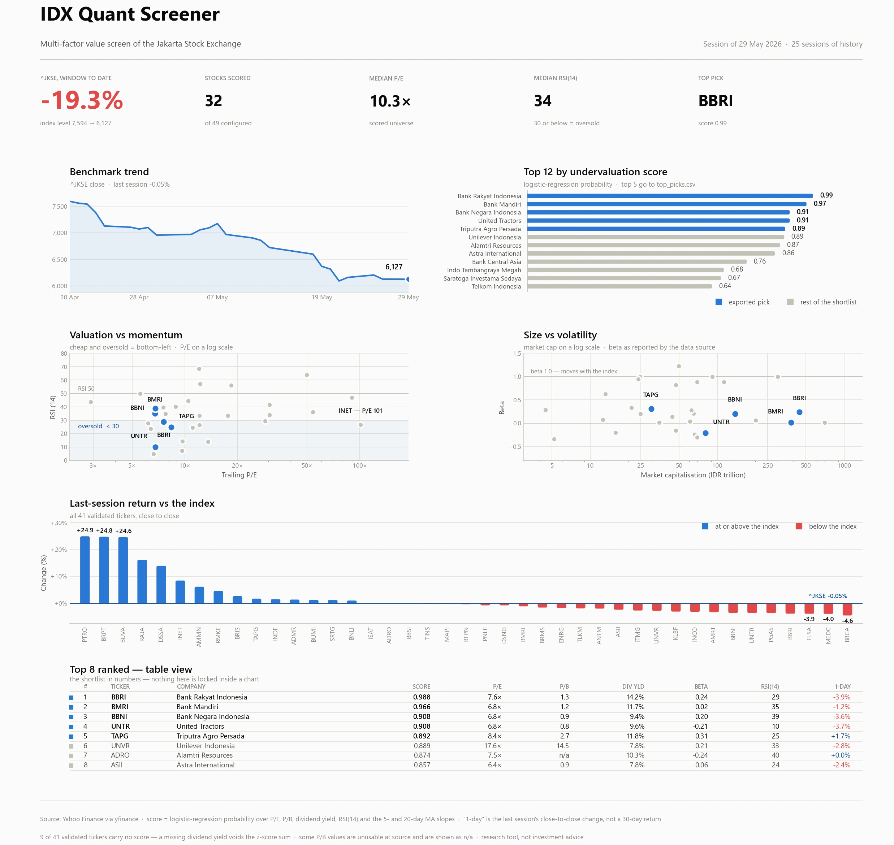

# IDX Quant Screener — Project Overview

A quantitative value screener for the **Indonesia Stock Exchange (IDX)**. It pulls
fundamentals and daily prices from Yahoo Finance, folds them into a single
*undervaluation score*, ranks the universe, and writes a CSV shortlist plus a
diagnostic chart.

This document maps the whole repository, traces the execution path from
[`main.py`](../main.py), documents the standalone notebook
[`notebooks/IDX_Quant_Screener.ipynb`](../notebooks/IDX_Quant_Screener.ipynb), and
records the behaviour discrepancies found while reading the code.



> `screener_analysis.webp` in this folder is a redesigned rendering of
> `data/output/screener_analysis.png` from the same run data — see
> [Snapshot](#snapshot) at the end.

> **This document describes the original build.** The PNG below is no longer
> written on every run: no page ever linked to it, its colours are baked white so
> it fought the brief's dark theme, and one panel plots `beta` — the field the
> scorer deliberately refuses to use. Its content now lives in the brief's
> **Advanced** mode as inline SVG. Pass `--png` if you still want the file.
> See the [README](../README.md) for current behaviour.

---

## 1. At a glance

| | |
|---|---|
| **Entry point** | [`main.py`](../main.py) → [`src/__main__.py`](../src/__main__.py) `main()` |
| **Python** | 3.13.7 (`.python-version`); README claims 3.10+ |
| **Universe** | 49 IDX tickers + `^JKSE` benchmark, in [`configs/default.yaml`](../configs/default.yaml) |
| **Model** | `LogisticRegression` + `StandardScaler`, walk-forward CV via `TimeSeriesSplit` |
| **Outputs** | `data/output/{screener_results.csv, top_picks.csv, summary.txt, screener_analysis.png}` |
| **Key deps** | pandas, numpy, yfinance, scikit-learn, pydantic-settings, tenacity, joblib, matplotlib, seaborn, loguru |
| **Tests** | one file, [`tests/test_fetcher.py`](../tests/test_fetcher.py) — currently broken (see §9) |
| **Version control** | none — the directory is not a git repository, despite a populated `.gitignore` |

---

## 2. Repository layout

```
idx_quant_screener/
├── main.py                     entry shim: path setup + call src.__main__.main()
├── configs/default.yaml        tickers, benchmark, indicator windows, ML features
├── .env.example                environment overrides (see §9, issue E)
├── src/
│   ├── __main__.py             the whole workflow, top to bottom
│   ├── core/
│   │   ├── config.py           pydantic-settings Settings + YAML deep-merge loader
│   │   └── logger.py           loguru sinks (stderr + rotating logs/screener.log)
│   ├── fetchers/data_fetcher.py   yfinance access, pickle cache, tenacity retry
│   ├── analysis/
│   │   ├── fundamental.py      validation + z-score / percentile scoring
│   │   ├── technical.py        MA, RSI(14), Bollinger, volume SMA, slopes
│   │   └── ml_ranker.py        StockRanker: train / predict / content-hash save
│   └── viz/renderer.py         ScreenerViz: the 3×2 matplotlib dashboard + summary.txt
├── notebooks/IDX_Quant_Screener.ipynb   standalone prototype (see §7)
├── data/cache/*.pkl            50 joblib-pickled OHLCV frames, TTL-checked
├── data/output/                CSVs, summary.txt, screener_analysis.png
├── models/                     27 ranker_v*.pkl + 27 scaler_v*.pkl, one pair per run
├── logs/screener.log           rotating loguru log
└── docs/                       this folder
```

---

## 3. Execution path from `main.py`

[`main.py`](../main.py) only prepends `src/` to `sys.path` and calls
`src.__main__.main()`. Everything below happens inside
[`src/__main__.py`](../src/__main__.py).

### Step 0 — configuration and logging (lines 17–26)

`load_settings("configs/default.yaml")` builds a `Settings` object from defaults +
environment, then **deep-merges** the YAML on top of it (dicts merge key-by-key,
scalars are replaced). `output_dir`, `model_dir` and `log_dir` are coerced to
`Path` and created. `setup_logger` then installs a coloured stderr sink at
`settings.log_level` and a DEBUG file sink at `logs/screener.log` (10 MB rotation,
30-day retention).

A `sectors` mapping is read if present. **The shipped YAML defines no `sectors`
key**, so every sector-aware branch downstream is inert by default.

### Step 1 — fetch (lines 29–32)

`DataFetcher` ([`src/fetchers/data_fetcher.py`](../src/fetchers/data_fetcher.py)):

- **`fetch_fundamentals(tickers)`** — one `yf.Ticker(t).info` call per ticker,
  extracting `marketCap`, `trailingPE`, `priceToBook`, `dividendYield`, `beta`.
  Tickers starting with `^` are skipped. Failures are logged and dropped, not
  retried; there is no cache on this path, so a run makes 49 live calls.
- **`fetch_technical_data(tickers)`** — per ticker, `_fetch_single()` returns a
  `data/cache/<ticker>.pkl` frame if it is younger than `cache_ttl_minutes`,
  otherwise calls `yf.download(period=f"{data_retention_days}d", auto_adjust=True)`,
  flattens a MultiIndex column header, and re-pickles. Wrapped in
  `@retry(stop_after_attempt(3), wait_exponential(2..10))`.
- The benchmark (`^JKSE`) goes through the same technical path.

`data_retention_days` defaults to 30 **calendar** days, which yields ~25 trading
sessions — the cached `^JKSE` frame has exactly 25 rows.

### Step 2 — fundamentals (lines 35–37)

`FundamentalEngine` ([`src/analysis/fundamental.py`](../src/analysis/fundamental.py))
accepts either a dict or a pydantic model and normalises to a dict.

`validate_fundamentals()` coerces the metric columns to numeric and hard-filters:

```
pe_ratio > 0        price_to_book > 0        -2 < beta < 5
```

In the recorded run this cut **49 → 41** tickers (ADHI, BBKP, EMAS, EXCL, GOTO,
MDKA, MMIX, WIKA dropped).

`compute_scores()` then applies `scoring_method`. The default is
`zscore_normalized`:

```
raw   = Σ  wᵢ · z(metricᵢ)        w = { pe_ratio: −1, price_to_book: −1,
                                        dividend_yield: +1, beta: −1 }
score = (raw − min raw) / (max raw − min raw)          → [0, 1]
```

Min–max rescaling means the score is **purely relative to the day's universe** —
the mean is pinned near 0.5 by construction, which is why `summary.txt` reports
`Avg Score: 0.50000594`.

A `percentile_rank` alternative exists, and a beta-based risk adjustment
(`score × (1 − clip(beta,0,2)/2)`) is implemented but gated behind
`risk_adjusted`, which defaults to `False` and is absent from the YAML.

### Step 3 — technicals (lines 40–53)

For each ticker, [`src/analysis/technical.py`](../src/analysis/technical.py)
`compute_indicators()` adds `MA_5`, `MA_20`, `rsi_14` (SMA-based Wilder variant),
`BB_Upper`/`BB_Lower`, `Volume_SMA(10)`, `price_change_pct`, `ma5_slope`,
`ma20_slope`. `extract_latest_indicators()` returns the **last row** of five of
them, plus `volume_ratio = Volume[-1] / Volume_SMA[-2]`.

`price_change_pct` is `Close.pct_change()` — a **single-session** move, not the
30-day change the top-level README describes.

The technical frame is left-joined onto the fundamental frame on `ticker`.

### Step 4 — ML ranking (lines 56–73)

`StockRanker` ([`src/analysis/ml_ranker.py`](../src/analysis/ml_ranker.py)):

1. Drop rows with NaN in any of the six ML features
   (`pe_ratio, price_to_book, dividend_yield, rsi_14, ma5_slope, ma20_slope`).
   Abort if fewer than `min_samples_for_training` (10) remain.
2. Build the label as `undervaluation_score > median(undervaluation_score)` — a
   median split of the **z-score** computed in step 2.
3. Report walk-forward accuracy over `TimeSeriesSplit(3)` (0.708 ± 0.118 in the
   recorded run), then refit scaler + model on the full set.
4. Persist both to `models/` under a SHA-256 content hash of the pickled object.

Back in `main()`, `predict()` returns `predict_proba[:, 1]` and **overwrites**
`undervaluation_score` for the 32 rows that had complete features. The final
ranking is that probability.

### Step 5 — output (lines 76–108)

`ScreenerViz.save_analysis()` ([`src/viz/renderer.py`](../src/viz/renderer.py))
drops rows with NaN in the four plotted columns, assigns a `global_rank`, and
renders a 3×2 grid at 200 dpi to `data/output/screener_analysis.png`:

| | left | right |
|---|---|---|
| **row 1** | `^JKSE` close line + last-session shading | every stock's 1-day % vs a benchmark line |
| **row 2** | all stocks by score, `RdYlGn`-coloured | P/E vs RSI scatter + colourbar |
| **row 3** | 1-day % again, re-sorted by score | market cap vs beta scatter + colourbar |

A 32-entry `rank. name` legend runs along the bottom. `_save_summary_stats()`
writes `summary.txt`.

`main()` then writes `top_picks.csv` (top 5) and `screener_results.csv` (all rows),
and prints the shortlist plus a one-line summary, with `UnicodeEncodeError`
fallbacks for consoles that cannot render the emoji.

---

## 4. Data flow, condensed

```
configs/default.yaml ─┐
.env / environment ───┼─► Settings ─► DataFetcher ─┬─► fundamentals (49 → live .info)
                      │                            └─► OHLCV (cache/*.pkl, 25 sessions)
                      │
                      ├─► FundamentalEngine.validate  49 → 41 rows
                      ├─► FundamentalEngine.scores    z-score → [0,1]
                      ├─► technical indicators        left-joined on ticker
                      ├─► StockRanker.train           41 → 32 complete rows
                      ├─► StockRanker.predict         overwrites the score
                      └─► ScreenerViz + CSV export    top 5 → top_picks.csv
```

**Funnel for the recorded run:** 49 configured → 41 pass validation → 32 scored →
5 exported.

---

## 5. Configuration surface

### `configs/default.yaml`

`stock_tickers` (49 `TICKER.JK: Name` pairs), `benchmarks` (`^JKSE`), `technical`
(`ma_periods`, `rsi_window`, `bb_window`), `fundamental_metrics`, `scoring_method`,
and `ml` (`features`, `scoring_method`, `walk_forward_splits`).

### `Settings` fields not present in the YAML

`app_env`, `log_level`, `data_retention_days`, `cache_ttl_minutes`,
`yfinance_timeout`, `max_retries`, `output_dir`, `model_dir`, `log_dir`,
`sectors`, `risk_adjusted`, `ml_random_state`, `min_samples_for_training`,
`ml_test_size`. `extra="allow"` means unknown YAML keys are accepted silently.

### Unused / inert settings

| Setting | Why it does nothing |
|---|---|
| `technical.*` | [`technical.py:8-10`](../src/analysis/technical.py#L8-L10) hardcodes `[5, 20]`, `14`, `20` |
| `sectors` | absent from the YAML; all sector branches no-op |
| `risk_adjusted` | defaults `False`, absent from the YAML |
| `max_retries` | `@retry` hardcodes `stop_after_attempt(3)` |
| `ml_test_size` | no train/test split in `StockRanker`; only `TimeSeriesSplit` |
| `ml.model_type`, `n_estimators`, `max_depth`, `learning_rate` | defaults describe gradient boosting; the code always builds `LogisticRegression` |

---

## 6. Artefacts

- **`data/cache/*.pkl`** — 50 joblib frames, one per ticker plus the index.
  Refreshed when older than `cache_ttl_minutes` (60).
- **`models/`** — 27 `ranker_v*.pkl` and 27 `scaler_v*.pkl`. A new pair is written
  every run whose fitted parameters differ; nothing prunes them.
- **`data/output/screener_results.csv`** — 41 rows × 13 columns, all metrics.
- **`data/output/top_picks.csv`** — top 5 with six columns.
- **`data/output/summary.txt`** — total, average score, top pick, average P/E, average RSI.
- **`logs/screener.log`** — full DEBUG trace, rotating at 10 MB.

### The recorded run (session of 29 May 2026)

| # | Ticker | Company | Score | P/E | P/B | Div yld | Beta | RSI(14) | 1-day |
|---|---|---|---|---|---|---|---|---|---|
| 1 | BBRI | Bank Rakyat Indonesia | 0.988 | 7.6× | 1.31 | 14.2% | 0.24 | 29 | −3.9% |
| 2 | BMRI | Bank Mandiri | 0.966 | 6.8× | 1.25 | 11.7% | 0.02 | 35 | −1.2% |
| 3 | BBNI | Bank Negara Indonesia | 0.908 | 6.8× | 0.86 | 9.4% | 0.20 | 39 | −3.6% |
| 4 | UNTR | United Tractors | 0.908 | 6.8× | 0.84 | 9.6% | −0.21 | 10 | −3.7% |
| 5 | TAPG | Triputra Agro Persada | 0.892 | 8.4× | 2.69 | 11.8% | 0.31 | 25 | +1.7% |

Context: `^JKSE` fell 7,594 → 6,127 (**−19.3%**) across the 25-session window, and
the median scored RSI(14) is 34 — the screen is running on a broadly sold-off
market, so low RSI readings are near-universal rather than stock-specific signals.

---

## 7. The notebook

[`notebooks/IDX_Quant_Screener.ipynb`](../notebooks/IDX_Quant_Screener.ipynb) is a
**standalone prototype**, not a driver or a test of the package. It imports nothing
from `src/` and shares no code. Seven cells:

| Cell | Contents |
|---|---|
| 0 | `FundamentallyTechnicalScreener` — 4 hardcoded tickers (`BBCA`, `TLKM`, `ASII`, `^JKSE`), fetch + indicator + scoring methods |
| 1 | Build the frame, print per-stock detail and the top 3 |
| 2 | `visualize_screener_results()` — a 2×2 matplotlib dashboard |
| 3 | `create_ml_classifier()` — `StandardScaler` + `train_test_split` + `LogisticRegression`, saved to `stock_classifier_model.pkl` in the working directory |
| 4 | Prints a would-be Streamlit dashboard structure (no Streamlit code) |
| 5 | Writes a `README.md` into the working directory and prints a wrap-up |
| 6 | (empty) |

### How it differs from the package

| | Notebook | Package |
|---|---|---|
| Universe | 4 tickers, hardcoded | 49 tickers, YAML |
| Index handling | `^JKSE` treated as a screenable stock (scores 0/100) | skipped for fundamentals, used only as a benchmark |
| Score | additive heuristic, 0–100 (+20 if P/E < 15, +15 if RSI < 30, +10 if move > 5%, +10 if beta < 1) | z-score composite → ML probability, 0–1 |
| `price_change_pct` | `Close[-1] / Open[0] − 1` — a true window return | `Close.pct_change()[-1]` — one session |
| ML | `train_test_split` on 4 samples; reported accuracy 1.000 | `TimeSeriesSplit(3)` on 32 samples; 0.708 ± 0.118 |
| Persistence | `./stock_classifier_model.pkl`, `./scaler.pkl` | content-hashed pairs in `models/` |
| Config / logging / retry | none | pydantic-settings, loguru, tenacity |

### Things to know before reusing it

- Cell 3 imports `RandomForestClassifier` and `LabelEncoder` and uses neither.
- With 4 samples, `train_test_split(test_size=0.2)` leaves a single test row; the
  printed **accuracy of 1.000 is noise**.
- The README that cell 5 generates asserts *"Accuracy: ~85% (based on backtesting
  against historical data), Max Drawdown: <15%, Sharpe Ratio: >1.2"*. **No backtest
  exists anywhere in this repository.** Those three numbers are unsupported.
- Cell 5 writes `README.md` relative to the working directory — running the
  notebook from the repository root would overwrite the project README.
- The notebook labels `TLKM.JK` as "Telkomsel"; it is Telkom Indonesia (the YAML
  gets this right).

[`notebooks/README.md`](../notebooks/README.md) documents the notebook accurately —
it describes the 0–100 heuristic and the 2×2 dashboard, not the package.

---

## 8. The two READMEs

- [`README.md`](../README.md) (root) documents the package. Accurate on structure,
  stack and usage. Overstated in three places: it advertises a "3x2 diagnostic
  dashboard comparing stocks against `^JKSE`" (true) but also "Risk-Adjusted
  Analysis" (implemented, never enabled) and "Advanced Technicals … Bollinger
  Bands" (computed, never surfaced in any output). Its sample output block is
  illustrative placeholder data, not a real run. Placeholders (`your-username`, `[Your Name]`) are unfilled.
- [`notebooks/README.md`](../notebooks/README.md) documents the notebook and
  matches it.

---

## 9. Verified issues

Each of these was reproduced against the current code and data.

**A. A single missing metric silently voids a stock's score.**
[`fundamental.py:102`](../src/analysis/fundamental.py#L102) accumulates
`df["undervaluation_score"] += w · z`, where `z` is computed from
`df[col].dropna()` and therefore carries a **shorter index**. pandas aligns on the
index, so every ticker missing that metric becomes `NaN` and stays `NaN`. In the
recorded run all 9 unscored tickers are exactly the 9 with a missing
`dividend_yield`. They vanish from the ranking, the chart and `summary.txt` without
a warning. A `.reindex(df.index)` or `fillna(0)` on `z` would fix it.

**B. The model is trained on the target it replaces.**
[`ml_ranker.py:34`](../src/analysis/ml_ranker.py#L34) derives `y` from a median
split of `undervaluation_score`, which at that moment is the z-score composite of
`pe_ratio`, `price_to_book`, `dividend_yield` and `beta` — three of which are also
input features. [`__main__.py:68`](../src/__main__.py#L68) then overwrites
`undervaluation_score` with the model's probability. The model is therefore
learning to reproduce its own inputs, and the 0.708 walk-forward accuracy measures
that, not predictive power. There is no forward return anywhere in the pipeline.

**C. `_try_load_latest_model()` can never succeed.**
[`ml_ranker.py:118`](../src/analysis/ml_ranker.py#L118) looks for the scaler by
substituting `ranker_` → `scaler_` in the model filename — but the two files are
named after *different* content hashes (`ranker_v2b8214ca34e9.pkl` pairs with
`scaler_vb153fa5978ce.pkl`). The derived name never exists, so `predict()` without
a prior `train()` always raises `RuntimeError`. Store the pair under one shared
hash, or write a small manifest.

**D. `technical.*` config is ignored.**
[`technical.py:8-10`](../src/analysis/technical.py#L8-L10) hardcodes
`ma_periods = [5, 20]`, `rsi_window = 14`, `bb_window = 20`. `compute_indicators()`
takes no settings argument, so editing the YAML changes nothing.

**E. Every key in `.env.example` is ignored.**
[`config.py:65`](../src/core/config.py#L65) sets `case_sensitive=True`, so
pydantic-settings matches env names to field names **exactly** — lowercase. The
example file ships `OUTPUT_DIR`, `LOG_LEVEL`, `CACHE_TTL_MINUTES` …, none of which
bind. Verified: with `OUTPUT_DIR=SHOULD_NOT_BIND` exported, `Settings().output_dir`
is still `data/output`. Either lowercase the example file or drop
`case_sensitive=True`.

**F. The test suite does not run.**
[`tests/test_fetcher.py:13`](../tests/test_fetcher.py#L13) calls
`fetcher.fetch_all()`, which `DataFetcher` does not define (it has
`fetch_fundamentals`, `fetch_technical_data`, `_fetch_single`), and then asserts on
an `undervaluation_score` column the fetcher never produces. The test also imports
`src.core.config` while the package's own modules import `core.config` — two
import roots for the same module, which will produce duplicate class objects if
both are ever loaded.

**G. "30-day price change" is a one-day change.** The root README and the chart
title both describe a 30-day move; the value plotted and exported is the last
session's close-to-close percentage. Note the notebook does compute a genuine
window return, so the two implementations disagree.

**H. `data_retention_days` is calendar days used as a trading window.**
[`data_fetcher.py:29`](../src/fetchers/data_fetcher.py#L29) passes `period="30d"`,
returning ~25 sessions. `MA_20` needs 20 of them, so `ma20_slope` has roughly five
valid points per ticker and the Bollinger bands are near-degenerate.

**I. Cache is deserialised before its TTL is checked.**
[`data_fetcher.py:22-27`](../src/fetchers/data_fetcher.py#L22-L27) calls
`joblib.load()` first and only then compares `st_mtime`, so a stale entry is fully
unpickled and thrown away. Also, the whole method sits inside `@retry`, so a
corrupt pickle is retried three times before surfacing.

**J. `models/` grows without bound.** 54 files — 27 ranker/scaler pairs — and
nothing prunes them or records which pair produced which output.

**K. Unreliable source values are plotted as-is.** `price_to_book` arrives from
yfinance as e.g. 13,529 (ADRO), 179,615 (PTRO) — unit glitches, not valuations.
They pass the `> 0` filter, enter the z-score, and reach the model. `dividend_yield`
similarly arrives as a percent (14.17) in some records where a fraction may be
expected. A plausibility band per metric would catch both.

**L. `setup_logger()` runs five times per process.** Four modules call it at
import time (`fundamental`, `ml_ranker`, `data_fetcher`, `renderer`), each doing
`logger.remove()` and re-adding sinks, before `main()` calls it again with the real
settings. Harmless today, order-dependent tomorrow. `renderer.py` also imports
`seaborn` and never uses it.

---

## 10. Running it

```bash
python -m venv .venv && .venv\Scripts\activate     # Windows
pip install -r requirements.txt                     # or requirements-dev.txt
copy .env.example .env                              # see issue E before relying on it
python main.py
```

Console output is the top-5 table plus `Analyzed N stocks | Avg Score: …`.
Everything else lands in `data/output/`.

Tests (`pytest`) currently fail — see issue F.

---

## Snapshot

`screener_analysis.webp` in this folder re-renders the same run from
`data/output/screener_results.csv` and `data/cache/^JKSE.pkl`. Regenerate with:

```bash
python docs/make_snapshot.py
```

What changed from `data/output/screener_analysis.png`:

| Original | Snapshot |
|---|---|
| `RdYlGn` value-ramp colouring every bar and dot by score | one accent hue for the five exported picks, neutral gray for context — colour marks identity, length carries the value |
| Two panels plotting the same 1-day return, sorted differently | one diverging panel; the freed space holds a header of run statistics and a table |
| 32-row colour legend across the bottom | a two-key legend, plus a real table of the top 8 |
| A number on every bar and a rank digit on every scatter point | direct labels only on the picks and the extremes |
| Black outlines on every mark, dashed gridlines | 2px surface rings and gaps, solid hairline chrome |
| Linear P/E and market-cap axes, outliers crushing the cluster | log axes with readable ticks |
| No provenance, no caveats | session date, funnel counts, and the "1-day not 30-day" and unscored-ticker footnotes on the face of the chart |

Palette: accent `#2a78d6`, diverging pole `#e34948`, de-emphasis `#c3c2b7` on a
`#fcfcfb` surface. The accent/negative pair clears all colour-vision checks
(worst-case CVD ΔE 21.6, normal-vision ΔE 32.3, both ≥ 3:1 on the surface).
